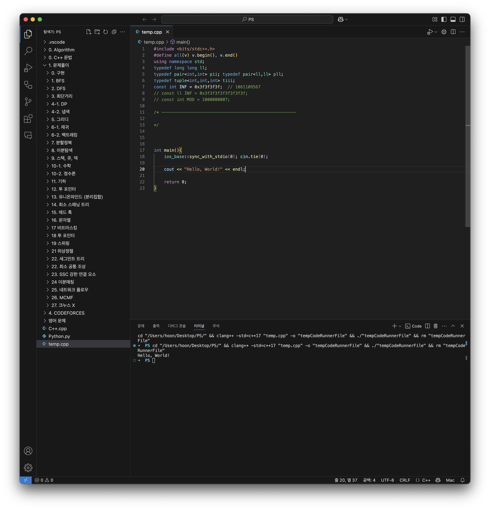

# Mac에서 bits/stdc++.h 사용

## bits/stdc++.h ?

모든 표준 라이브러리가 포함된 헤더

이 헤더는 표준 헤더가 아니기에 GCC가 아닌 컴파일러로 컴파일이 되지 않지만,

[백준 온라인 저지](http://acmicpc.net/), [코드포스](http://codeforces.com/), ACM-ICPC 등 GCC를 컴파일러로 사용하는 대회에서 유용하게 사용할 수 있음.

하지만 맥에서 설정을 해줘야함.

<br>

## Setting

- 다음 명령어로 g++ install 경로 파악

```bash
g++ --version
```

```bash
Apple clang version 16.0.0 (clang-1600.0.26.6)
Target: arm64-apple-darwin24.3.0
Thread model: posix
InstalledDir: /Applications/Xcode.app/Contents/Developer/Toolchains/XcodeDefault.xctoolchain/usr/bin
```

- 경로를 복사하고 open을 통해서 finder로 열기

```bash
open /Applications/Xcode.app/Contents/Developer/Toolchains/XcodeDefault.xctoolchain/usr/bin
```


- 여기서 오른쪽 아래 usr을 클릭해 상위 폴더로


- **include** 폴더로 이동해 bits 폴더 생성


- 다음 파일 `bits` 폴더에 넣기

- [stdc++.h](stdc++.h)

- 이제 빨간줄이 없어지고 정상적으로 사용된다.
  

